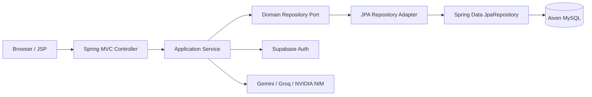

# 필담

Spring Boot 4.1.0과 JSP로 구현한 AI 채팅 웹 애플리케이션입니다. Supabase Auth로 사용자를 인증하고, 계정·대화방·메시지는 Aiven for MySQL에 Spring Data JPA로 저장합니다. AI 응답은 선택한 모델에 따라 Google Gemini, Groq 또는 NVIDIA NIM을 사용합니다.

- 배포 URL: <https://justwrite-gwf7.onrender.com>
- Java: 17
- 패키징: Spring Boot executable WAR
- 배포: Render Docker Web Service

## 기술 스택

| 영역 | 기술 |
|---|---|
| Web | Spring Boot 4.1.0, Spring MVC, JSP/JSTL |
| Persistence | Spring Data JPA, Hibernate, Flyway |
| Database | Aiven for MySQL, MySQL Connector/J |
| Authentication | Supabase Auth, HTTP Session |
| AI | Google Gemini, Groq, NVIDIA NIM |
| Frontend | JSP, Fetch API, Tailwind CSS, marked, DOMPurify |
| Build/Deploy | Maven Wrapper, Docker, Render |
| Test | JUnit 5, Spring Boot Test, H2, 실제 Aiven smoke test |

## 아키텍처

애플리케이션은 presentation, application, domain, infrastructure 계층을 사용합니다. Domain Repository는 Spring/JPA에 의존하지 않는 포트이며, infrastructure의 JPA adapter가 Spring Data `JpaRepository`에 작업을 위임합니다.



`AccountRepository`, `ChatRoomRepository`, `ChatRepository`는 도메인 계약입니다. 실제 JPA 구현은 다음처럼 분리되어 있습니다.

```text
ChatRepository
└── JpaChatRepositoryAdapter
    └── ChatJpaRepository extends JpaRepository<ChatEntity, Long>
```

## 프로젝트 구조

```text
src/main/
├── java/com/example/archat/
│   ├── ArchatApplication.java
│   ├── application/
│   │   ├── auth/
│   │   └── chat/
│   ├── domain/
│   │   ├── auth/
│   │   └── chat/
│   ├── infrastructure/
│   │   ├── auth/                 # Supabase Auth client
│   │   ├── chat/                 # AI provider implementations
│   │   ├── config/               # Spring configuration/properties
│   │   ├── persistence/
│   │   │   ├── adapter/          # Domain Repository 구현
│   │   │   ├── entity/           # JPA Entity
│   │   │   └── repository/       # Spring Data JpaRepository
│   │   └── session/
│   └── presentation/
│       ├── auth/
│       ├── chat/
│       └── common/               # AuthInterceptor
├── resources/
│   ├── application.yml
│   └── db/migration/
│       └── V1__create_initial_schema.sql
└── webapp/
    ├── css/
    ├── js/
    └── WEB-INF/views/

src/test/
├── java/                          # Unit, MVC, JPA, migration tests
└── resources/application-test.yml
```

## 주요 기능과 요청 흐름

- 로그인/회원가입: Supabase Auth 인증 후 Aiven의 `account`를 upsert하고 세션을 생성합니다.
- 대화방: 사용자 소유권을 확인한 뒤 생성, 조회, 이름 변경, 삭제합니다.
- 채팅: 사용자 메시지를 저장하고 대화 이력을 AI Provider에 전달한 뒤 AI 응답을 저장합니다.
- 화면: Fetch API의 optimistic UI와 Markdown 렌더링을 사용합니다.

주요 endpoint는 다음과 같습니다.

| Method | Path | 설명 |
|---|---|---|
| GET | `/`, `/login`, `/signup` | 화면 진입 및 인증 화면 |
| POST | `/login`, `/signup`, `/logout` | Form 인증 처리 |
| GET | `/api/auth/me` | 현재 인증 상태 |
| POST | `/api/auth/login`, `/api/auth/signup`, `/api/auth/logout` | JSON 인증 API |
| GET | `/chat` | 대화방과 메시지 조회 |
| POST | `/chat` | 메시지 전송 또는 `action` 기반 대화방 관리 |

상세 흐름은 [데이터 흐름](docs/DATA_FLOW.md)을 참고합니다.

## 환경 변수

`.env.sample`을 기준으로 값을 준비합니다. 저장소의 `.env` 파일은 Git에 포함하지 않습니다.

### 런타임 필수 값

```dotenv
# Aiven for MySQL
AIVEN_MYSQL_HOST=
AIVEN_MYSQL_PORT=
AIVEN_MYSQL_DATABASE=
AIVEN_MYSQL_USER=
AIVEN_MYSQL_PASSWORD=
AIVEN_MYSQL_SSL_MODE=REQUIRED

# Supabase Auth
SUPABASE_URL=
SUPABASE_ANON_KEY=
SUPABASE_SERVICE_ROLE_KEY=

# AI Providers
GEMINI_API_KEY=
GROQ_API_KEY=
NIM_API_KEY=
```

### 서버 설정

```dotenv
PORT=10000
APP_COOKIE_SECURE=false
SESSION_TIMEOUT_MINUTES=30
```

Render에서는 `APP_COOKIE_SECURE=true`를 권장합니다. `SUPABASE_DB_URL`, `SUPABASE_DB_USER`, `SUPABASE_DB_PASSWORD`는 원본 데이터 이관·검증 테스트 전용이며 애플리케이션 런타임에는 필요하지 않습니다.

Spring Boot는 프로젝트 루트의 `.env`를 자동으로 읽지 않습니다. 로컬에서는 IDE Run Configuration이나 운영체제 환경 변수로 주입하고, Render에서는 Web Service의 Environment 설정에 등록합니다.

## 로컬 실행

요구사항은 JDK 17입니다.

```powershell
.\mvnw.cmd spring-boot:run
```

기본 포트는 `10000`이며 `PORT`로 변경할 수 있습니다.

## 테스트와 패키징

```powershell
.\mvnw.cmd test
.\mvnw.cmd package
java -jar target\archat-1.0-SNAPSHOT.war
```

일반 테스트는 H2의 MySQL 호환 모드를 사용합니다. 실제 외부 DB 테스트는 환경 변수가 있을 때만 실행되며, `PostgresToAivenMigrationTest`는 `RUN_DATA_MIGRATION=true`를 명시해야 실행됩니다. 이미 이관된 Aiven DB에는 이 일회성 테스트를 다시 실행하지 않습니다.

## 데이터베이스 관리

- Flyway가 `V1__create_initial_schema.sql`을 적용합니다.
- Hibernate는 `ddl-auto=validate`로 Entity와 스키마의 일치 여부만 확인합니다.
- 운영 테이블을 수동으로 생성하거나 `ddl-auto=update`로 변경하지 않습니다.
- 모든 시간 값은 UTC 기준 `DATETIME(6)`으로 저장합니다.
- 문자셋은 `utf8mb4`입니다.

현재 스키마는 [DB 스키마](docs/DATABASE_SCHEMA.md)를 참고합니다.

## 배포

Render는 저장소의 `Dockerfile`로 실행 가능한 WAR를 빌드하고 실행합니다. 배포 환경에는 `.env`와 별도로 모든 환경 변수를 등록해야 합니다.

- Free Web Service는 유휴 상태에서 중지되어 첫 접속 시 cold start가 발생할 수 있습니다.
- Aiven과 Supabase, AI Provider의 플랜·사용량은 각 서비스 Dashboard에서 관리합니다.
- NVIDIA Developer Program NIM endpoint는 개발·평가 용도이므로 공개 운영 시 라이선스를 별도로 확인합니다.

자세한 절차와 장애 대응은 [배포 및 운영](docs/DEPLOYMENT_AND_OPERATIONS.md)을 참고합니다.

## 마이그레이션 상태

2026-07-24에 다음 전환을 완료했습니다.

```text
Supabase PostgreSQL → Aiven MySQL
Servlet             → Spring MVC
JDBC                → Spring Data JPA
기존 WAR            → Spring Boot executable WAR
```

Supabase Auth는 유지합니다. 기존 계정 9건, 대화방 4건, 메시지 28건을 이관했으며 원본/대상의 내용, UTC 시간과 외래키 무결성을 검증했습니다.

## 관련 문서

- [데이터 흐름 및 아키텍처](docs/DATA_FLOW.md)
- [Aiven MySQL 스키마](docs/DATABASE_SCHEMA.md)
- [Render/Aiven 배포 및 운영](docs/DEPLOYMENT_AND_OPERATIONS.md)
