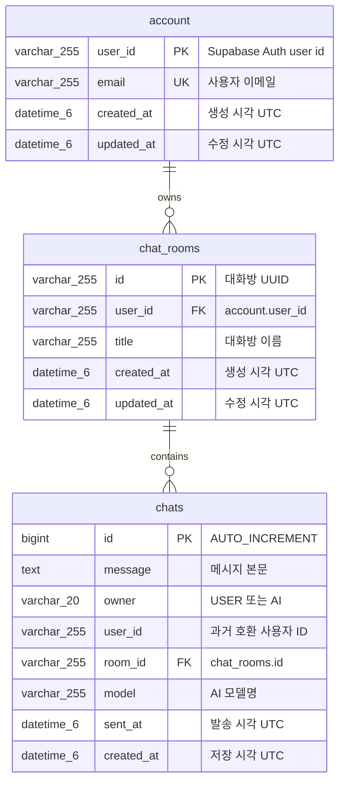

# Aiven MySQL 데이터베이스 스키마

## 1. 관리 원칙

필담의 애플리케이션 데이터는 Aiven for MySQL에 저장합니다. Supabase는 사용자 인증만 담당하며 비밀번호는 Aiven DB에 저장하지 않습니다.

실행 가능한 스키마의 단일 원본은 [`V1__create_initial_schema.sql`](../src/main/resources/db/migration/V1__create_initial_schema.sql)입니다.

- Flyway가 애플리케이션 시작 시 migration을 적용합니다.
- Hibernate는 `ddl-auto=validate`로 Entity와 스키마 일치 여부만 확인합니다.
- 운영 테이블을 수동 생성하거나 기존 Flyway 파일을 적용 후 수정하지 않습니다.
- 스키마 변경은 새로운 `V2__...sql`, `V3__...sql` 파일로 추가합니다.

## 2. ERD



모든 테이블은 InnoDB, `utf8mb4`, `utf8mb4_unicode_ci`를 사용합니다.

## 3. `account`

Supabase Auth의 사용자 ID와 애플리케이션에서 사용할 이메일을 연결합니다.

| 컬럼 | MySQL 타입 | NULL | 제약/기본값 |
|---|---|---:|---|
| `user_id` | `VARCHAR(255)` | 불가 | PK |
| `email` | `VARCHAR(255)` | 불가 | UNIQUE (`uk_account_email`) |
| `created_at` | `DATETIME(6)` | 불가 | `CURRENT_TIMESTAMP(6)` |
| `updated_at` | `DATETIME(6)` | 불가 | `CURRENT_TIMESTAMP(6)`, update 시 자동 갱신 |

로그인과 회원가입 성공 시 `JpaAccountRepositoryAdapter`가 Supabase `userId` 기준으로 account를 upsert합니다.

## 4. `chat_rooms`

| 컬럼 | MySQL 타입 | NULL | 제약/기본값 |
|---|---|---:|---|
| `id` | `VARCHAR(255)` | 불가 | PK, 애플리케이션 생성 UUID |
| `user_id` | `VARCHAR(255)` | 불가 | FK → `account.user_id` |
| `title` | `VARCHAR(255)` | 불가 | 대화방 제목 |
| `created_at` | `DATETIME(6)` | 불가 | `CURRENT_TIMESTAMP(6)` |
| `updated_at` | `DATETIME(6)` | 불가 | `CURRENT_TIMESTAMP(6)`, update 시 자동 갱신 |

- Index: `idx_chat_rooms_user_created (user_id, created_at)`
- FK: `fk_chat_rooms_account`
- Account 삭제 시 해당 사용자의 대화방을 `ON DELETE CASCADE`로 삭제합니다.

## 5. `chats`

| 컬럼 | MySQL 타입 | NULL | 제약/기본값 |
|---|---|---:|---|
| `id` | `BIGINT` | 불가 | PK, `AUTO_INCREMENT` |
| `message` | `TEXT` | 허용 | 메시지 본문 |
| `owner` | `VARCHAR(20)` | 불가 | `USER` 또는 `AI` |
| `user_id` | `VARCHAR(255)` | 허용 | 이전 데이터 호환용 사용자 ID |
| `room_id` | `VARCHAR(255)` | 불가 | FK → `chat_rooms.id` |
| `model` | `VARCHAR(255)` | 허용 | AI 모델 식별자 |
| `sent_at` | `DATETIME(6)` | 허용 | 애플리케이션 발송 시각 UTC |
| `created_at` | `DATETIME(6)` | 불가 | `CURRENT_TIMESTAMP(6)` |

- Index: `idx_chats_room_id_id (room_id, id)`
- FK: `fk_chats_room`
- 대화방 삭제 시 하위 메시지를 `ON DELETE CASCADE`로 삭제합니다.

## 6. JPA 관계

- `ChatRoomEntity` → `AccountEntity`: `@ManyToOne(fetch = LAZY)`
- `ChatEntity` → `ChatRoomEntity`: `@ManyToOne(fetch = LAZY)`
- Domain record와 JPA Entity는 adapter에서 상호 변환합니다.
- JSP나 Controller 응답에 JPA Entity를 직접 노출하지 않습니다.

## 7. 검증 SQL

```sql
SELECT COUNT(*) FROM account;
SELECT COUNT(*) FROM chat_rooms;
SELECT COUNT(*) FROM chats;

SELECT COUNT(*) AS orphan_rooms
FROM chat_rooms cr
LEFT JOIN account a ON a.user_id = cr.user_id
WHERE a.user_id IS NULL;

SELECT COUNT(*) AS orphan_chats
FROM chats c
LEFT JOIN chat_rooms cr ON cr.id = c.room_id
WHERE cr.id IS NULL;
```

마지막 두 결과는 항상 `0`이어야 합니다.
