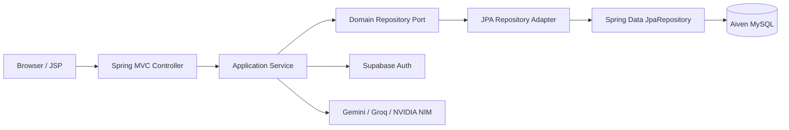
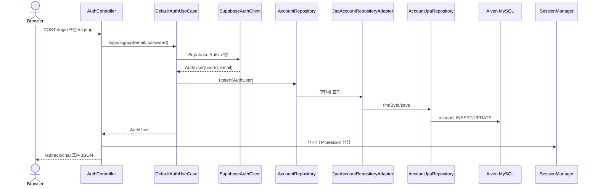
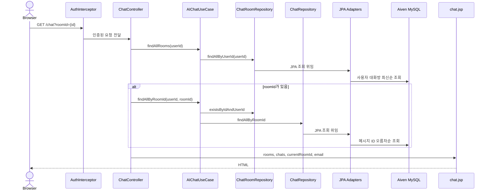
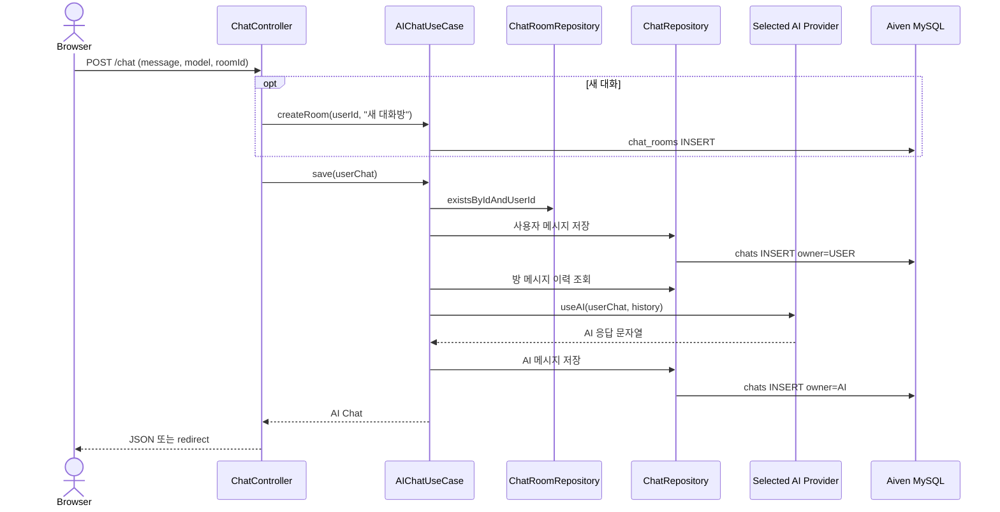

# 필담 데이터 흐름 및 아키텍처

## 1. 전체 구조

필담은 Spring MVC와 port-adapter 스타일을 적용합니다. Application 계층은 Domain Repository 인터페이스에만 의존하고, infrastructure의 JPA adapter가 domain 객체와 JPA Entity를 변환합니다.



| 계층 | 주요 구성요소 | 책임 |
|---|---|---|
| Presentation | `AuthController`, `ChatController`, `AuthInterceptor`, JSP | HTTP 요청, 인증 보호, View/JSON 응답 |
| Application | `DefaultAuthUseCase`, `AIChatUseCase` | 인증·대화방·채팅 유스케이스 조합 |
| Domain | `AuthUser`, `ChatRoom`, `Chat`, Repository interfaces | 프레임워크 독립 모델과 저장소 계약 |
| Infrastructure | Supabase Auth client, AI providers, JPA adapter/entity/repository | 외부 API 및 Aiven MySQL 구현 |

## 2. 인증 흐름

Supabase는 인증만 담당하고 애플리케이션 계정 정보는 Aiven MySQL에 저장합니다. 비밀번호는 애플리케이션 DB에 저장하지 않습니다.



`AuthInterceptor`는 `/chat`과 `/chat/**` 요청을 보호합니다. 인증 정보가 없으면 `/login`으로 이동합니다.

## 3. 대화방과 메시지 조회



모든 방 조회·변경·삭제는 `roomId`와 `userId`를 함께 검사하여 다른 사용자의 데이터 접근을 막습니다.

## 4. 메시지 전송과 AI 응답

메시지 전송은 `action` 파라미터가 없는 `POST /chat` 요청입니다.



Provider 선택 규칙은 다음과 같습니다.

- 모델명에 `gemini` 또는 `gemma` 포함: Google GenAI
- 모델명이 `meta/`로 시작하거나 `nvidia`, `nemotron` 포함: NVIDIA NIM
- 그 외 모델: Groq OpenAI-compatible API

사용자 메시지 저장과 AI 외부 호출은 하나의 긴 DB 트랜잭션으로 묶지 않습니다. 따라서 AI 호출이 실패하면 이미 저장된 사용자 메시지가 남을 수 있으며, 재시도·실패 상태 관리는 후속 개선 대상입니다.

## 5. JPA 저장 흐름

```text
Domain Model
  ↕ mapping
Jpa*RepositoryAdapter (@Repository)
  ↓
*JpaRepository extends JpaRepository<Entity, ID>
  ↓
Hibernate / MySQL Connector/J
  ↓
Aiven MySQL
```

| Domain Port | Adapter | Spring Data Repository | Entity |
|---|---|---|---|
| `AccountRepository` | `JpaAccountRepositoryAdapter` | `AccountJpaRepository` | `AccountEntity` |
| `ChatRoomRepository` | `JpaChatRoomRepositoryAdapter` | `ChatRoomJpaRepository` | `ChatRoomEntity` |
| `ChatRepository` | `JpaChatRepositoryAdapter` | `ChatJpaRepository` | `ChatEntity` |

## 6. Endpoint

| Method | Path | 처리 |
|---|---|---|
| GET | `/` | `/chat`으로 이동 |
| GET | `/login`, `/signup` | JSP 인증 화면 |
| POST | `/login`, `/signup`, `/logout` | Form 인증 및 세션 처리 |
| POST | `/api/auth/login`, `/api/auth/signup`, `/api/auth/logout` | JSON 인증 API |
| GET | `/api/auth/me` | 현재 세션 상태 |
| GET | `/chat` | 방 목록과 선택 방 메시지 조회 |
| POST | `/chat` | 메시지 전송 (`action` 없음) |
| POST | `/chat?action=createRoom` | 대화방 생성 |
| POST | `/chat?action=deleteRoom` | 소유한 대화방 삭제 |
| POST | `/chat?action=renameRoom` | 소유한 대화방 이름 변경 |

## 7. 시간과 문자 처리

- 애플리케이션에서 받은 `ZonedDateTime`은 UTC `LocalDateTime`으로 변환합니다.
- MySQL에는 `DATETIME(6)`으로 저장합니다.
- JDBC URL과 Hibernate time zone은 UTC입니다.
- DB/table/connection 문자셋은 `utf8mb4`를 사용하여 한글과 이모지를 보존합니다.
