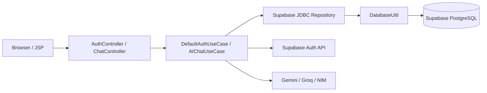
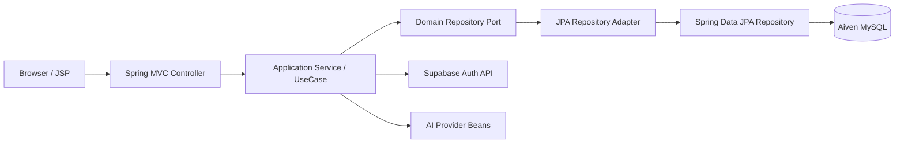
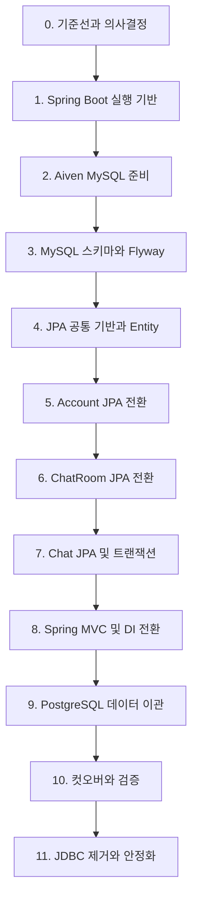

# ArChat Spring Boot + JPA + Aiven MySQL 마이그레이션 가이드

## 현재 이행 상태 (2026-07-24)

완료:

- Spring Boot 4.1.0 기반 executable WAR 전환
- JSP 및 기존 URL 유지
- Spring MVC Controller와 인증 interceptor 전환
- Supabase Auth Spring Bean 전환 및 유지
- MySQL Connector/J, Spring Data JPA, Hibernate 적용
- Account, ChatRoom, Chat Entity/Repository/adapter 구현
- Flyway MySQL 초기 스키마 작성
- Aiven 환경변수 기반 DataSource 설정
- 서비스 계층 트랜잭션과 사용자별 방 소유권 검증
- JDBC/PostgreSQL 구현 제거
- Spring Context, MVC, JPA Repository 테스트 추가
- Spring Boot 실행형 Dockerfile 전환
- 실제 Aiven MySQL 8.4 연결, Flyway V1 적용 및 Hibernate schema validation 확인
- 실제 Aiven 대상 JPA 쓰기/조회/롤백과 JSP/인증 redirect smoke test 통과
- Supabase PostgreSQL 데이터를 Aiven MySQL로 이관 (계정 9건, 채팅방 4건, 메시지 28건)
- 원본/대상 레코드 내용, UTC 시간, 한글 및 외래키 무결성 비교 검증 통과

운영 컷오버 전에 완료할 항목:

- 기존 Supabase DB를 사용하는 배포의 쓰기 중단
- 실제 사용자 계정으로 Supabase Auth 로그인 및 AI Provider 응답 smoke test
- 운영용 Aiven CA 신원 검증(`VERIFY_CA` 또는 `VERIFY_IDENTITY`) 구성
- 운영 컷오버 및 모니터링

외부 준비 절차는 [Aiven MySQL 준비 및 전환 체크리스트](AIVEN_MYSQL_SETUP.md)를 따른다.

## 1. 문서 목적

이 문서는 현재 ArChat 애플리케이션을 다음 목표 구조로 단계적으로 전환하기 위한 실행 가이드다.

| 구분 | 현재 | 목표 |
|---|---|---|
| 데이터베이스 | Supabase PostgreSQL | Aiven for MySQL |
| 웹 프레임워크 | JSP + Jakarta Servlet | JSP + Spring Boot MVC |
| 데이터 접근 | JDBC, `PreparedStatement` | Spring Data JPA + Hibernate |
| 객체 생성/연결 | 직접 생성, static singleton | Spring Bean + 생성자 주입 |
| 트랜잭션 | JDBC 호출별 개별 연결 | 서비스 계층의 `@Transactional` |
| 스키마 관리 | 수동 SQL 문서 | Flyway migration + JPA 검증 |
| 패키징 | 외부 Tomcat용 WAR | 실행 가능한 Spring Boot WAR |

이 마이그레이션은 DB 엔진, 애플리케이션 프레임워크, 영속성 기술을 동시에 변경한다. 전체 코드를 한 번에 교체하지 않고, 각 단계가 끝날 때 실행 가능한 상태를 유지하는 것을 원칙으로 한다.

---

## 2. 가장 먼저 결정할 사항: Supabase Auth 처리

> Aiven for MySQL은 데이터베이스 서비스이며 인증 서비스가 아니다.

현재 애플리케이션에서 Supabase는 두 가지 역할을 담당한다.

1. Supabase PostgreSQL: `account`, `chat_rooms`, `chats` 데이터 저장
2. Supabase Auth: 로그인, 회원가입, 사용자 ID 및 토큰 발급

따라서 `Supabase -> Aiven`이라는 요구사항은 아래 두 선택지 중 하나로 명확히 해야 한다.

### 선택 A: Supabase Auth 유지 — 1차 마이그레이션 권장안

- 애플리케이션 데이터만 Aiven MySQL로 이동한다.
- `SupabaseAuthClient`는 유지하되 Spring Bean으로 전환한다.
- Supabase Auth가 반환하는 `userId`를 Aiven의 `account.user_id`에 계속 저장한다.
- 기존 사용자는 비밀번호 재설정 없이 계속 로그인할 수 있다.
- DB 마이그레이션과 인증 시스템 교체를 분리할 수 있어 위험이 가장 낮다.

### 선택 B: Supabase Auth도 제거

- Spring Security 또는 별도의 인증 공급자를 도입해야 한다.
- 비밀번호 저장 정책, 해싱 알고리즘, 이메일 인증, 비밀번호 재설정, 세션 정책을 새로 설계해야 한다.
- 기존 사용자의 비밀번호 원문은 데이터베이스로 옮길 수 없다. 인증 정보 내보내기 가능 범위를 먼저 확인하고, 불가능하면 비밀번호 재설정 절차가 필요하다.
- 이 작업은 DB 교체와 분리된 후속 프로젝트로 진행하는 것을 권장한다.

이 문서의 기본 경로는 **선택 A: Supabase Auth 유지**다. 선택 B를 택하면 15장의 추가 작업을 선행하거나 별도 마이그레이션으로 수행한다.

---

## 3. 현재 구조 분석

### 3.1 현재 요청 흐름



### 3.2 현재 마이그레이션 대상

| 현재 구성요소 | 문제 또는 변경 이유 | 목표 구성요소 |
|---|---|---|
| `DatabaseUtil` | 드라이버 로드와 연결을 직접 관리 | Spring Boot `DataSource` + HikariCP |
| `SupabaseAccountRepository` | PostgreSQL `ON CONFLICT`와 JDBC 사용 | Spring Data JPA 기반 Account adapter |
| `SupabaseChatRoomRepository` | JDBC CRUD 및 수동 매핑 | Spring Data JPA ChatRoom adapter |
| `SupabaseChatRepository` | JDBC CRUD 및 수동 매핑 | Spring Data JPA Chat adapter |
| `AuthController extends HttpServlet` | 직접 요청 분기 및 JSON 직렬화 | Spring MVC `@Controller` |
| `ChatController extends HttpServlet` | GET/POST/action 분기가 한 클래스에 집중 | Spring MVC Controller 및 명확한 handler method |
| `AuthFilter` | Servlet annotation 기반 | Spring MVC `HandlerInterceptor` |
| `EncodingFilter` | 직접 인코딩 처리 | Spring Boot 인코딩 설정 |
| `getInstance()` singleton | 테스트와 의존성 교체가 어려움 | `@Service`, `@Component`, 생성자 주입 |
| PostgreSQL 전용 DDL | `TIMESTAMPTZ`, `SERIAL`, `ON CONFLICT` 사용 | MySQL 호환 DDL 및 JPA 매핑 |

### 3.3 유지해야 할 호환성

- JSP 화면과 현재 CSS/JavaScript 동작
- `/login`, `/signup`, `/logout`, `/chat`, `/api/auth/*` URL
- 로그인 세션 및 쿠키 정책
- 사용자별 채팅방 분리
- 채팅방 목록의 최신순 정렬
- 메시지 이력의 입력순 정렬
- Gemini, Groq, NVIDIA NIM 호출
- AJAX 요청에 대한 기존 JSON 응답 구조

---

## 4. 목표 아키텍처



권장 패키지 구조는 다음과 같다.

```text
src/main/java/com/example/archat/
├── ArchatApplication.java
├── application/
│   ├── auth/
│   └── chat/
├── domain/
│   ├── auth/
│   │   ├── AuthUser.java
│   │   └── AccountRepository.java
│   └── chat/
│       ├── Chat.java
│       ├── ChatRoom.java
│       ├── ChatRepository.java
│       └── ChatRoomRepository.java
├── infrastructure/
│   ├── auth/
│   ├── ai/
│   ├── persistence/
│   │   ├── entity/
│   │   │   ├── AccountEntity.java
│   │   │   ├── ChatRoomEntity.java
│   │   │   └── ChatEntity.java
│   │   ├── repository/
│   │   │   ├── AccountJpaRepository.java
│   │   │   ├── ChatRoomJpaRepository.java
│   │   │   └── ChatJpaRepository.java
│   │   └── adapter/
│   └── session/
└── presentation/
    ├── auth/
    ├── chat/
    └── common/

src/main/resources/
├── application.yml
├── application-local.yml
├── application-test.yml
└── db/migration/
    └── V1__create_initial_schema.sql

src/main/webapp/WEB-INF/views/
├── login.jsp
├── signup.jsp
└── chat.jsp
```

### Entity와 domain record 분리

현재 `AuthUser`, `ChatRoom`, `Chat`은 Java record다. JPA Entity는 식별자와 기본 생성자가 필요하고 지연 로딩을 위한 proxy 제약도 있으므로 record를 직접 Entity로 만들지 않는다.

```text
Domain record <-> JPA adapter/mapper <-> JPA Entity
```

JPA Entity가 Controller 응답이나 JSP 모델에 직접 노출되지 않도록 한다.

---

## 5. 전체 마이그레이션 단계



단계별로 별도 PR을 만들고, 각 PR에서 빌드와 테스트가 성공한 뒤 다음 단계로 이동한다.

---

## 6. 0단계: 기준선 확보와 설계 결정

### 6.1 작업 전 보호 조치

- 현재 작업 트리의 `chat.jsp` 변경을 별도 커밋으로 보존한다.
- 마이그레이션 전용 브랜치를 만든다.
- 현재 Supabase PostgreSQL을 백업한다.
- 현재 애플리케이션의 화면과 API 응답을 기록한다.
- 운영 중이면 마이그레이션 일정과 쓰기 중단 시간을 합의한다.
- `.env`와 인증서가 Git에 포함되지 않는지 확인한다.

### 6.2 기준 데이터 기록

전환 전 아래 값을 기록한다.

```sql
SELECT COUNT(*) FROM account;
SELECT COUNT(*) FROM chat_rooms;
SELECT COUNT(*) FROM chats;

SELECT MIN(id), MAX(id) FROM chats;

SELECT COUNT(*)
FROM chat_rooms cr
LEFT JOIN account a ON a.user_id = cr.user_id
WHERE a.user_id IS NULL;

SELECT COUNT(*)
FROM chats c
LEFT JOIN chat_rooms cr ON cr.id = c.room_id
WHERE c.room_id IS NOT NULL AND cr.id IS NULL;
```

마지막 두 쿼리 결과가 0이 아니면 외래키를 추가하기 전에 고아 데이터를 정리해야 한다.

### 6.3 확정할 설계 결정

- Supabase Auth 유지 여부
- MySQL 데이터베이스 이름
- 시간 저장 기준: UTC 권장
- `chats.timestamp`를 유지할지 `sent_at`으로 정규화할지
- 기존 데이터의 `room_id IS NULL` 허용 여부
- 외래키 삭제 정책: `ON DELETE CASCADE` 사용 여부
- 운영 배포 형태: 실행 가능한 WAR 또는 외부 Tomcat 배포
- 테스트 DB: Testcontainers MySQL 권장, 단순 단위 테스트는 mock 병행

### 6.4 완료 조건

- 현재 애플리케이션을 빌드할 수 있다.
- 기준 화면/API 동작과 데이터 건수를 기록했다.
- 백업 파일 복구 가능성을 확인했다.
- 위 설계 결정이 문서 또는 이슈에 남아 있다.

---

## 7. 1단계: Spring Boot 실행 기반 전환

이 단계에서는 기존 JDBC Repository를 유지한다. Spring Boot 문제와 JPA/MySQL 문제를 동시에 디버깅하지 않기 위해서다.

### 7.1 Maven 변경

`pom.xml`에 Spring Boot dependency management와 다음 의존성을 적용한다.

```xml
<dependency>
    <groupId>org.springframework.boot</groupId>
    <artifactId>spring-boot-starter-webmvc</artifactId>
</dependency>

<dependency>
    <groupId>org.apache.tomcat.embed</groupId>
    <artifactId>tomcat-embed-jasper</artifactId>
</dependency>

<dependency>
    <groupId>jakarta.servlet.jsp.jstl</groupId>
    <artifactId>jakarta.servlet.jsp.jstl-api</artifactId>
</dependency>

<dependency>
    <groupId>org.glassfish.web</groupId>
    <artifactId>jakarta.servlet.jsp.jstl</artifactId>
</dependency>

<dependency>
    <groupId>org.springframework.boot</groupId>
    <artifactId>spring-boot-starter-webmvc-test</artifactId>
    <scope>test</scope>
</dependency>

<dependency>
    <groupId>org.springframework.boot</groupId>
    <artifactId>spring-boot-starter-data-jpa-test</artifactId>
    <scope>test</scope>
</dependency>
```

- Java 17을 유지한다.
- JSP 호환성을 위해 `<packaging>war</packaging>`을 유지한다.
- `spring-boot-maven-plugin`을 적용한다.
- 최종 Spring Boot 버전은 작업 시작 시 지원 상태를 확인하고 팀에서 하나로 고정한다.

### 7.2 애플리케이션 진입점

실행 가능한 WAR와 외부 Tomcat 배포를 모두 지원하려면 메인 클래스가 `SpringBootServletInitializer`를 확장하도록 구성한다.

```java
@SpringBootApplication
@ServletComponentScan
public class ArchatApplication extends SpringBootServletInitializer {

    @Override
    protected SpringApplicationBuilder configure(SpringApplicationBuilder builder) {
        return builder.sources(ArchatApplication.class);
    }

    public static void main(String[] args) {
        SpringApplication.run(ArchatApplication.class, args);
    }
}
```

`@ServletComponentScan`은 전환 기간에 기존 `@WebServlet`, `@WebFilter`를 임시로 실행하기 위한 장치다. 모든 Controller와 Filter를 Spring 방식으로 바꾼 뒤 제거한다.

### 7.3 JSP 설정

```yaml
spring:
  mvc:
    view:
      prefix: /WEB-INF/views/
      suffix: .jsp

server:
  port: ${PORT:10000}
  servlet:
    session:
      timeout: ${SESSION_TIMEOUT_MINUTES:30}m
      cookie:
        http-only: true
        secure: ${APP_COOKIE_SECURE:false}
        same-site: lax
```

### 7.4 1단계 테스트

- Spring Context가 로드된다.
- `/login`, `/signup`, `/chat` JSP가 기존과 동일하게 렌더링된다.
- 정적 자원 경로가 유지된다.
- 기존 JDBC를 사용한 로그인 및 채팅 기능이 동작한다.
- `mvn test`와 `mvn package`가 성공한다.

---

## 8. 2단계: Aiven MySQL 준비

### 8.1 Aiven 서비스 생성

1. Aiven Console에서 MySQL 서비스를 생성한다.
2. 애플리케이션과 가까운 region을 선택한다.
3. 서비스의 Overview에서 다음 연결 정보를 확인한다.
   - Host
   - Port
   - Database
   - Username
   - Password
   - CA Certificate
4. 가능하면 애플리케이션 전용 DB 사용자와 최소 권한을 사용한다.
5. 접근 허용 네트워크와 방화벽 정책을 설정한다.

### 8.2 환경변수

기존 DB 환경변수는 다음과 같이 교체한다.

```dotenv
AIVEN_MYSQL_HOST=
AIVEN_MYSQL_PORT=
AIVEN_MYSQL_DATABASE=
AIVEN_MYSQL_USER=
AIVEN_MYSQL_PASSWORD=
AIVEN_MYSQL_SSL_MODE=REQUIRED
```

Supabase Auth를 유지하면 아래 값은 계속 필요하다.

```dotenv
SUPABASE_URL=
SUPABASE_ANON_KEY=
SUPABASE_SERVICE_ROLE_KEY=
```

아래 PostgreSQL 접속 환경변수는 최종 컷오버와 롤백 기간이 끝난 뒤 제거한다.

```dotenv
SUPABASE_DB_URL=
SUPABASE_DB_USER=
SUPABASE_DB_PASSWORD=
```

### 8.3 Spring DataSource 설정

```yaml
spring:
  datasource:
    url: jdbc:mysql://${AIVEN_MYSQL_HOST}:${AIVEN_MYSQL_PORT}/${AIVEN_MYSQL_DATABASE}?sslMode=${AIVEN_MYSQL_SSL_MODE:REQUIRED}&serverTimezone=UTC&characterEncoding=UTF-8
    username: ${AIVEN_MYSQL_USER}
    password: ${AIVEN_MYSQL_PASSWORD}
  jpa:
    open-in-view: false
    hibernate:
      ddl-auto: validate
    properties:
      hibernate:
        jdbc:
          time_zone: UTC
        format_sql: true
```

주의사항:

- Aiven의 Java 연결 예시는 TLS가 필수인 JDBC URL을 사용한다.
- `REQUIRED`는 연결 암호화를 강제하지만 서버 신원까지 검증하지 않는다.
- 운영에서는 Aiven CA를 truststore에 등록하고 `VERIFY_CA` 또는 `VERIFY_IDENTITY` 사용을 검토한다.
- 비밀번호나 CA 파일을 저장소에 커밋하지 않는다.
- Spring Boot Data JPA starter는 기본적으로 HikariCP를 사용하므로 `DatabaseUtil`처럼 연결을 직접 생성하지 않는다.

### 8.4 연결 확인

- 로컬에서 Aiven MySQL 접속을 확인한다.
- Spring Boot 애플리케이션이 DataSource를 생성하는지 확인한다.
- 잘못된 자격 증명과 SSL 설정에서 애플리케이션이 명확히 실패하는지 확인한다.
- Aiven Console에서 연결 수를 확인해 connection leak이 없는지 확인한다.

---

## 9. 3단계: PostgreSQL 스키마를 MySQL 스키마로 변환

Aiven의 MySQL 연속 마이그레이션 기능은 MySQL 계열 원본을 대상으로 한다. 현재 원본은 PostgreSQL이므로 PostgreSQL DDL을 그대로 가져오거나 MySQL 간 복제 절차를 사용할 수 없다. **MySQL용 스키마를 새로 만들고 데이터를 변환해 적재**해야 한다.

### 9.1 타입 변환표

| PostgreSQL | MySQL 목표 | 비고 |
|---|---|---|
| `VARCHAR(n)` | `VARCHAR(n)` | 문자셋 `utf8mb4` |
| `TEXT` | `TEXT` 또는 `LONGTEXT` | 메시지 최대 길이 확인 |
| `TIMESTAMPTZ` | `DATETIME(6)` | 애플리케이션과 DB 모두 UTC 사용 |
| `SERIAL` | `BIGINT AUTO_INCREMENT` | JPA `IDENTITY`와 매핑 |
| `NOW()` | `CURRENT_TIMESTAMP(6)` | 정밀도 통일 |
| `ON CONFLICT` | JPA 로직 또는 `ON DUPLICATE KEY UPDATE` | PostgreSQL SQL 재사용 금지 |

### 9.2 권장 초기 스키마

아래 스키마는 설계 기준 예시다. 실제 마이그레이션 전에 현재 운영 데이터의 null과 길이를 검사해야 한다.

```sql
CREATE TABLE account (
    user_id VARCHAR(255) NOT NULL,
    email VARCHAR(255) NOT NULL,
    created_at DATETIME(6) NOT NULL DEFAULT CURRENT_TIMESTAMP(6),
    updated_at DATETIME(6) NOT NULL DEFAULT CURRENT_TIMESTAMP(6)
        ON UPDATE CURRENT_TIMESTAMP(6),
    PRIMARY KEY (user_id),
    UNIQUE KEY uk_account_email (email)
) ENGINE=InnoDB DEFAULT CHARSET=utf8mb4 COLLATE=utf8mb4_unicode_ci;

CREATE TABLE chat_rooms (
    id VARCHAR(255) NOT NULL,
    user_id VARCHAR(255) NOT NULL,
    title VARCHAR(255) NOT NULL,
    created_at DATETIME(6) NOT NULL DEFAULT CURRENT_TIMESTAMP(6),
    updated_at DATETIME(6) NOT NULL DEFAULT CURRENT_TIMESTAMP(6)
        ON UPDATE CURRENT_TIMESTAMP(6),
    PRIMARY KEY (id),
    KEY idx_chat_rooms_user_created (user_id, created_at),
    CONSTRAINT fk_chat_rooms_account
        FOREIGN KEY (user_id) REFERENCES account(user_id)
        ON DELETE CASCADE
) ENGINE=InnoDB DEFAULT CHARSET=utf8mb4 COLLATE=utf8mb4_unicode_ci;

CREATE TABLE chats (
    id BIGINT NOT NULL AUTO_INCREMENT,
    message TEXT NULL,
    owner VARCHAR(20) NOT NULL,
    user_id VARCHAR(255) NULL,
    room_id VARCHAR(255) NOT NULL,
    model VARCHAR(255) NULL,
    sent_at DATETIME(6) NULL,
    created_at DATETIME(6) NOT NULL DEFAULT CURRENT_TIMESTAMP(6),
    PRIMARY KEY (id),
    KEY idx_chats_room_id_id (room_id, id),
    CONSTRAINT fk_chats_room
        FOREIGN KEY (room_id) REFERENCES chat_rooms(id)
        ON DELETE CASCADE
) ENGINE=InnoDB DEFAULT CHARSET=utf8mb4 COLLATE=utf8mb4_unicode_ci;
```

`ON DELETE CASCADE`를 사용하면 방 삭제 시 메시지가 DB에서 함께 삭제된다. 적용하지 않는다면 서비스의 `@Transactional` 메서드가 메시지를 먼저 삭제하고 방을 삭제해야 한다. 두 전략을 동시에 복잡하게 유지하지 말고 하나를 기준으로 정한다.

### 9.3 `timestamp` 컬럼 처리

현재 `chats.timestamp`는 `ZonedDateTime.toString()` 결과를 `VARCHAR(100)`으로 저장한다. 목표 구조에서는 다음 절차를 권장한다.

1. 기존 문자열을 파싱할 수 있는지 전체 데이터 검사
2. 파싱 성공 값을 UTC로 변환
3. MySQL `sent_at DATETIME(6)`에 저장
4. 파싱 실패 행은 별도 오류 CSV로 분리
5. 오류 행 처리 합의 후 이관

변환 위험을 낮추려면 1차 이관에서는 `timestamp VARCHAR(100)`을 유지하고, 별도 Flyway 버전에서 `sent_at`을 추가하는 방식도 가능하다.

### 9.4 Flyway 적용

- 첫 번째 스키마를 `V1__create_initial_schema.sql`로 관리한다.
- 이후 모든 DB 변경은 새 migration 파일로 추가한다.
- 운영 설정에서는 `spring.jpa.hibernate.ddl-auto=validate`를 사용한다.
- `update`, `create`, `create-drop`을 운영에서 사용하지 않는다.
- 선택한 Spring Boot/Flyway 버전에 맞는 MySQL 지원 모듈을 함께 추가한다.

---

## 10. 4단계: JPA Entity와 Repository 기반 구축

### 10.1 Entity 핵심 매핑

#### AccountEntity

- `@Entity`, `@Table(name = "account")`
- `userId`: `@Id`, 직접 할당
- `email`: unique, not null
- `createdAt`, `updatedAt`: `LocalDateTime` 또는 `Instant` 중 하나로 통일

#### ChatRoomEntity

- 문자열 UUID를 기존과 동일하게 유지
- `AccountEntity`와 지연 로딩 `@ManyToOne`
- 목록 조회는 `userId`, `createdAt DESC`

#### ChatEntity

- `id`: `@GeneratedValue(strategy = GenerationType.IDENTITY)`
- `ChatRoomEntity`와 지연 로딩 `@ManyToOne`
- `owner`: 우선 `VARCHAR` 매핑을 유지하고 애플리케이션 enum으로 제한
- `sentAt`: UTC 기준 시간 타입

### 10.2 연관관계 원칙

- 기본은 `@ManyToOne(fetch = FetchType.LAZY)` 단방향 매핑이다.
- `@OneToMany` 컬렉션은 실제 사용 사례가 있을 때만 추가한다.
- Entity를 JSP나 JSON에 직접 전달하지 않는다.
- `spring.jpa.open-in-view=false`로 설정하고 서비스 안에서 필요한 데이터를 DTO/domain으로 변환한다.
- `equals`/`hashCode`에 지연 로딩 연관관계를 포함하지 않는다.

### 10.3 Spring Data Repository 예시

```java
public interface ChatRoomJpaRepository
        extends JpaRepository<ChatRoomEntity, String> {

    List<ChatRoomEntity> findAllByAccountUserIdOrderByCreatedAtDesc(String userId);
}

public interface ChatJpaRepository
        extends JpaRepository<ChatEntity, Long> {

    List<ChatEntity> findAllByChatRoomIdOrderByIdAsc(String roomId);

    long deleteAllByChatRoomId(String roomId);
}
```

메서드 이름 기반 쿼리가 지나치게 길어지거나 소유권 조건이 복잡해지면 `@Query`를 사용한다.

### 10.4 테스트

- 실제 MySQL과 문법·정렬·시간 동작이 다른 H2만으로 검증하지 않는다.
- Repository 통합 테스트는 Testcontainers MySQL 또는 전용 Aiven test DB를 사용한다.
- 운영 Aiven DB를 자동화 테스트 대상으로 사용하지 않는다.

---

## 11. 5~7단계: Repository를 기능별로 교체

### 11.1 Account 먼저 교체

Account가 가장 작으므로 JPA 연결 검증을 위한 첫 수직 기능으로 사용한다.

1. Account JPA Repository와 adapter 작성
2. 로그인/회원가입 결과를 `account`에 저장
3. 기존 `upsert` 의미 구현
4. 같은 `user_id` 로그인 시 이메일 갱신 확인
5. 테스트 성공 후에만 JDBC Account 구현 제거

JPA `save()`는 식별자 상태에 따라 `persist` 또는 `merge` 경로가 달라질 수 있다. 동시 로그인과 이메일 unique 충돌을 테스트하고, 원자적 upsert가 반드시 필요하면 MySQL native query 사용을 명시적으로 선택한다.

### 11.2 ChatRoom 교체

1. 방 생성
2. 사용자별 목록 최신순 조회
3. 방 이름 변경
4. 사용자 소유권을 포함한 수정/삭제
5. 존재하지 않는 방 처리
6. 다른 사용자 방 접근 차단

현재 코드는 `roomId`만으로 수정과 삭제가 가능하다. 목표 코드는 최소한 `userId + roomId`로 소유권을 검증해야 한다.

### 11.3 Chat 교체

1. 사용자 메시지 저장
2. `roomId`별 `id ASC` 이력 조회
3. AI 응답 저장
4. 메시지 및 모델 길이/NULL 정책 검증
5. 방 삭제와 메시지 삭제의 원자성 검증

AI API 호출을 DB 트랜잭션 안에서 오래 유지하지 않도록 주의한다. 권장 흐름은 다음과 같다.

```text
짧은 트랜잭션: 사용자 메시지 저장
        ↓
트랜잭션 밖: AI API 호출
        ↓
짧은 트랜잭션: AI 응답 저장
```

두 저장을 반드시 하나의 원자적 작업으로 취급해야 한다면 외부 API 실패, 재시도, 중복 저장을 포함한 별도 상태 모델이 필요하다.

---

## 12. 8단계: Servlet을 Spring MVC로 전환

JPA 기능이 안정화된 뒤 Controller와 객체 생성을 Spring 방식으로 바꾼다.

### 12.1 Controller 매핑

| 기존 Servlet 분기 | Spring MVC 목표 |
|---|---|
| `doGet()` + `/login` 비교 | `@GetMapping("/login")` |
| `doPost()` + `/login` 비교 | `@PostMapping("/login")` |
| `doGet()` + `/signup` 비교 | `@GetMapping("/signup")` |
| `doPost()` + `/signup` 비교 | `@PostMapping("/signup")` |
| `/api/auth/*` + `pathInfo` | `@RequestMapping("/api/auth")` 아래 handler |
| `/chat?action=createRoom` | 명시적인 POST handler 또는 기존 parameter 호환 handler |
| 직접 `ObjectMapper` 생성 | Spring이 관리하는 JSON converter |

전환 중에는 프런트엔드 변경을 최소화하기 위해 기존 URL과 parameter를 먼저 유지한다. API 정리는 기능 호환이 확인된 후 별도 PR로 진행한다.

### 12.2 Bean 전환

- `DefaultAuthUseCase` -> `@Service`
- `AIChatUseCase` -> `@Service`
- `SupabaseAuthClient` -> `@Component`
- AI Provider 구현 -> `@Component` 또는 `@Bean`
- 설정 클래스 -> `@ConfigurationProperties`
- `SessionManager` -> Spring Bean
- 모든 `getInstance()` 제거
- 모든 의존성은 생성자 주입

### 12.3 Filter와 세션

- 인증 검사는 `HandlerInterceptor`로 이동한다.
- `/chat`과 향후 `/api/chat/**`를 보호한다.
- 로그인/회원가입/정적 자원은 제외한다.
- 문자열 인코딩은 Spring Boot 설정에 맡긴다.
- 기존 쿠키 이름, timeout, secure, httpOnly, sameSite 동작을 회귀 테스트한다.

### 12.4 MVC 테스트

- 비로그인 `/chat` -> `/login` redirect
- 로그인 사용자 `/chat` -> 200 및 JSP view
- form login/signup 처리
- JSON login/signup 처리
- 세션 만료 시 기존 오류 코드 유지
- AJAX 채팅 응답의 JSON 구조 유지

---

## 13. 9단계: PostgreSQL 데이터를 Aiven MySQL로 이관

### 13.1 권장 전략

현재 데이터 규모가 크지 않다면 **점검 가능한 maintenance window 기반 export-transform-import**가 가장 단순하다.

1. 사전 전체 이관 리허설
2. 검증 쿼리와 변환 오류 수정
3. 컷오버 시 쓰기 중단
4. 최종 export
5. MySQL import
6. 건수/관계/샘플 검증
7. 애플리케이션 연결 전환

PostgreSQL에서 MySQL로 DB 엔진이 바뀌므로 Aiven의 MySQL-to-MySQL continuous migration을 그대로 적용할 수 없다. 무중단이 반드시 필요하면 CDC/ETL 도구를 별도 검토해야 하며 프로젝트 범위가 커진다.

### 13.2 백업

- Supabase PostgreSQL 전체 schema + data dump
- 테이블별 CSV export
- export 시각과 기준 row count 기록
- 백업 파일의 암호화 및 접근 권한 설정
- 복구 리허설 또는 최소한 dump 검증

### 13.3 Export 순서

외래키 부모부터 내보내고 가져온다.

```text
account -> chat_rooms -> chats
```

CSV는 반드시 다음 조건을 고정한다.

- UTF-8
- header 포함 여부
- delimiter
- quote 및 escape 규칙
- NULL 표현
- 줄바꿈 포함 메시지 처리
- timestamp timezone 처리

메시지에는 쉼표, 따옴표, 줄바꿈이 포함될 수 있으므로 단순 문자열 분리 스크립트를 사용하지 않는다.

### 13.4 Transform

- `TIMESTAMPTZ` 값을 UTC `DATETIME(6)` 값으로 변환
- `SERIAL id`를 `BIGINT`로 유지
- `timestamp VARCHAR`를 유지하거나 `sent_at`으로 파싱
- `owner` 값을 허용 목록(`USER`, `AI`)과 비교
- 빈 문자열과 NULL을 구분
- MySQL reserved word 및 identifier 차이 점검
- 문자열 길이 초과 행을 별도 보고서로 분리

### 13.5 Import

1. 빈 Aiven migration DB에 Flyway로 스키마 생성
2. Account import
3. ChatRoom import
4. Chat import
5. 외래키 오류 확인
6. `AUTO_INCREMENT`가 `MAX(chats.id) + 1`보다 작지 않은지 확인
7. 애플리케이션 전용 사용자의 권한 확인

### 13.6 데이터 검증

두 DB에서 다음을 비교한다.

- 각 테이블 row count
- 최소/최대 ID
- 사용자별 방 개수
- 방별 메시지 개수
- NULL 개수
- 고아 ChatRoom/Chat 개수
- 최근/과거/긴 메시지 샘플
- 한글, 이모지, 줄바꿈 보존
- 시간 값이 UTC 기준으로 일치하는지

MySQL 검증 예시:

```sql
SELECT COUNT(*) FROM account;
SELECT COUNT(*) FROM chat_rooms;
SELECT COUNT(*) FROM chats;
SELECT MIN(id), MAX(id) FROM chats;

SELECT COUNT(*) AS orphan_rooms
FROM chat_rooms cr
LEFT JOIN account a ON a.user_id = cr.user_id
WHERE a.user_id IS NULL;

SELECT COUNT(*) AS orphan_chats
FROM chats c
LEFT JOIN chat_rooms cr ON cr.id = c.room_id
WHERE cr.id IS NULL;

SELECT room_id, COUNT(*)
FROM chats
GROUP BY room_id
ORDER BY COUNT(*) DESC
LIMIT 20;
```

검증 결과는 재현 가능하도록 파일 또는 배포 기록에 남긴다.

---

## 14. 10~11단계: 컷오버, 롤백, 정리

### 14.1 컷오버 체크리스트

- [ ] 모든 자동화 테스트 통과
- [ ] 이관 리허설 성공
- [ ] Supabase PostgreSQL 최종 백업
- [ ] 사용자 쓰기 중단 또는 maintenance mode 적용
- [ ] 최종 데이터 export/import
- [ ] row count와 고아 데이터 검증
- [ ] Aiven 연결 환경변수 적용
- [ ] Spring Boot 애플리케이션 배포
- [ ] 로그인/회원가입 smoke test
- [ ] 채팅방 생성/이름 변경/삭제 smoke test
- [ ] 사용자 메시지와 AI 응답 저장 확인
- [ ] 로그의 SQL/credential 노출 여부 확인
- [ ] Aiven connection 수와 오류율 확인

### 14.2 롤백 기준

다음 상황에서는 롤백을 고려한다.

- 데이터 건수가 일치하지 않음
- 한글/이모지/시간 데이터 손상
- 로그인 후 Account 저장 실패
- 채팅방 소유권 또는 외래키 오류
- AI 응답 저장 실패율 급증
- Aiven 연결 장애나 connection pool 고갈

### 14.3 롤백 절차

1. 새 애플리케이션 쓰기를 중단한다.
2. 컷오버 이후 MySQL에 발생한 쓰기 건수를 기록한다.
3. 이전 애플리케이션과 Supabase PostgreSQL 연결 설정으로 복귀한다.
4. 서비스 복구를 확인한다.
5. MySQL에만 기록된 데이터를 별도 export하여 재이관 계획을 세운다.

컷오버 이후 양쪽 DB에 동시에 쓰면 정합성 문제가 커진다. 별도 dual-write 설계 없이 두 DB 쓰기를 병행하지 않는다.

### 14.4 안정화 후 제거 대상

- `DatabaseUtil`
- PostgreSQL JDBC Driver
- `SupabaseAccountRepository`
- `SupabaseChatRoomRepository`
- `SupabaseChatRepository`
- DB용 `SUPABASE_DB_*` 환경변수
- `@WebServlet`, `@WebFilter`, `@ServletComponentScan`
- static singleton과 `getInstance()`
- 직접 생성한 `ObjectMapper`
- 불필요해진 `web.xml`

Supabase Auth를 유지한다면 `SupabaseAuthClient`와 Auth 관련 환경변수는 제거하지 않는다.

---

## 15. Supabase Auth까지 제거할 경우의 추가 절차

이 절차는 Aiven DB 전환과 분리해 수행하는 것을 권장한다.

1. 인증 방식 결정
   - Spring Security session login
   - 외부 OAuth/OIDC Provider
   - 별도 인증 서버
2. 사용자 식별자 유지/변환 정책 결정
3. 비밀번호 hash 이전 가능성 확인
4. 불가능한 경우 전체 사용자 password reset 계획 수립
5. 이메일 인증 및 비밀번호 재설정 기능 구현
6. 로그인 실패 횟수 제한, CSRF, session fixation 방지 적용
7. `account`와 credential 테이블 분리
8. Supabase Auth API 의존 제거
9. 기존 사용자 로그인 전환 테스트
10. 충분한 유예 기간 후 Supabase Auth 종료

비밀번호 원문을 export하거나 애플리케이션 DB에 평문으로 저장해서는 안 된다.

---

## 16. 테스트 전략

### 16.1 테스트 계층

| 테스트 | 목적 | 권장 도구 |
|---|---|---|
| Domain 단위 테스트 | 변환, 검증, 정책 | JUnit 5 |
| Repository 테스트 | MySQL 매핑과 쿼리 | `@DataJpaTest` + Testcontainers MySQL |
| Service 테스트 | 트랜잭션과 비즈니스 흐름 | JUnit + Mockito 또는 통합 테스트 |
| MVC 테스트 | URL, redirect, JSON, session | `@WebMvcTest`, MockMvc |
| 전체 통합 테스트 | JSP부터 DB까지 주요 흐름 | `@SpringBootTest` + MySQL container |
| 배포 smoke test | 실제 Aiven 연결과 사용자 흐름 | staging 환경 |

### 16.2 필수 시나리오

- 회원가입 후 Account 생성
- 기존 사용자 재로그인 시 Account 갱신
- 비로그인 사용자의 `/chat` 접근 차단
- 빈 채팅방 목록
- 사용자별 방 격리
- 채팅방 최신순 조회
- 채팅 이력 입력순 조회
- 긴 메시지, 한글, 이모지, 줄바꿈 저장
- AI API 실패 시 사용자 메시지 상태
- 다른 사용자의 방 수정/삭제 차단
- 방 삭제 시 하위 Chat 처리
- 중복 요청과 재시도 시 중복 저장 여부
- 세션 만료 응답

---

## 17. 3인 팀 권장 분담

| 담당 | 주 책임 | 주요 산출물 |
|---|---|---|
| A: Boot/Auth | Spring Boot 기반, JSP, 설정, Auth MVC/Session | Boot WAR, Auth Controller, interceptor, Account 기능 |
| B: DB/JPA | Aiven, MySQL DDL, Flyway, Entity, Repository | migration SQL, Entity/adapter, Repository 테스트, 이관 스크립트 |
| C: Chat/통합 | Chat/ChatRoom service, AI Bean, 트랜잭션, 배포 | Chat MVC, AI 설정, 통합 테스트, Docker/README |

공통 작업:

- Entity 관계와 시간 타입은 세 명이 함께 결정한다.
- 각 담당자가 자기 기능의 테스트를 작성한다.
- 리뷰는 `A -> B -> C -> A` 순환 방식으로 한다.
- 데이터 이관과 운영 컷오버는 최소 두 명이 함께 검증한다.
- 테스트 전체를 통합 담당자 한 명에게 몰아주지 않는다.

### 권장 PR 순서

1. `chore: establish migration baseline`
2. `build: bootstrap Spring Boot executable war`
3. `infra: configure Aiven MySQL and Flyway`
4. `feat: add JPA entities and repository tests`
5. `refactor: migrate account persistence to JPA`
6. `refactor: migrate chat room persistence to JPA`
7. `refactor: migrate chat persistence and transactions to JPA`
8. `refactor: migrate servlet controllers to Spring MVC`
9. `data: add PostgreSQL to MySQL migration and validation tooling`
10. `deploy: switch runtime to Spring Boot and Aiven MySQL`
11. `chore: remove legacy JDBC and servlet bootstrap code`

---

## 18. 단계별 Definition of Done

각 단계는 다음 조건을 모두 만족해야 완료로 본다.

- 애플리케이션이 컴파일된다.
- 기존 테스트와 새 테스트가 통과한다.
- 새로운 설정값이 `.env.sample`에 반영된다.
- 비밀 정보가 Git에 포함되지 않는다.
- 변경된 DB 구조가 Flyway 파일에 반영된다.
- JSP와 API의 기존 사용자 동작이 유지된다.
- 로그에 DB 비밀번호, Supabase key, AI key가 출력되지 않는다.
- 롤백 방법이 PR 설명에 기록되어 있다.
- 다른 팀원 한 명 이상의 리뷰를 받았다.

---

## 19. 주요 위험과 대응

| 위험 | 영향 | 대응 |
|---|---|---|
| Supabase Auth와 DB 역할 혼동 | 로그인 전체 중단 | Auth 유지/제거 결정을 별도 게이트로 관리 |
| PostgreSQL DDL 직접 사용 | MySQL schema 생성 실패 | Flyway MySQL DDL을 새로 작성 |
| `TIMESTAMPTZ` 변환 | 시간 왜곡 | UTC 통일 및 샘플/경계값 검증 |
| `timestamp` 문자열 파싱 | 일부 Chat 유실 | 실패 행 격리 및 재처리 |
| 이모지 문자셋 | 메시지 저장 실패/손상 | DB/table/connection 모두 `utf8mb4` |
| JPA N+1 | 채팅방 조회 성능 저하 | DTO 조회, fetch 전략, SQL 로그 검증 |
| Open Session in View | Controller/View에서 예기치 않은 쿼리 | `open-in-view=false` |
| 긴 AI 호출과 DB 트랜잭션 | connection pool 고갈 | 외부 호출을 긴 트랜잭션 밖에서 수행 |
| 소유권 검증 누락 | 타 사용자 데이터 접근 | 모든 room 작업에 `userId` 조건 추가 |
| `ddl-auto=update` | 운영 schema 예측 불가 | Flyway + `ddl-auto=validate` |
| 직접 cutover | 데이터 차이 발견 시 복구 지연 | 사전 이관 리허설과 rollback runbook |

---

## 20. 최종 완료 기준

- 애플리케이션이 Spring Boot executable WAR로 실행된다.
- JSP 화면과 기존 URL이 정상 동작한다.
- 애플리케이션 데이터가 Aiven MySQL에 저장된다.
- 모든 DB 접근이 Spring Data JPA 또는 명시적으로 승인된 JPA query를 사용한다.
- JDBC `DatabaseUtil`과 PostgreSQL driver가 제거된다.
- DB schema가 Flyway로 재현 가능하다.
- Supabase PostgreSQL과 Aiven MySQL의 이관 데이터가 검증됐다.
- Account, ChatRoom, Chat의 주요 테스트가 통과한다.
- 사용자별 데이터 소유권이 보장된다.
- 삭제와 갱신에 필요한 트랜잭션이 적용됐다.
- 운영 모니터링과 롤백 절차가 준비됐다.

---

## 21. 참고 자료

- [Aiven for MySQL 시작하기](https://aiven.io/docs/products/mysql/get-started)
- [Aiven for MySQL Java 연결](https://aiven.io/docs/products/mysql/howto/connect-with-java)
- [Aiven TLS/SSL 인증서](https://aiven.io/docs/platform/concepts/tls-ssl-certificates)
- [MySQL Connector/J SSL 설정](https://dev.mysql.com/doc/connectors/en/connector-j-reference-using-ssl.html)
- [Spring Boot SQL Databases 및 Spring Data JPA](https://docs.spring.io/spring-boot/reference/data/sql.html)
- [Spring Boot WAR 배포](https://docs.spring.io/spring-boot/how-to/deployment/traditional-deployment.html)
- [Spring Boot Maven Plugin 실행 가능 아카이브](https://docs.spring.io/spring-boot/maven-plugin/packaging.html)
- [Flyway MySQL 지원](https://documentation.red-gate.com/fd/mysql-277579322.html)

---

## 22. 실제 작업 시작 권장점

첫 번째 구현 PR의 범위는 다음으로 제한한다.

> 현재 JSP, URL, Supabase Auth, AI Provider, JDBC 동작을 유지하면서 Spring Boot executable WAR로 실행되도록 변환한다. 이 PR에서는 Aiven 연결과 JPA Repository 교체를 하지 않는다.

첫 PR이 성공한 후 Aiven test DB와 Flyway 스키마를 준비하고, Account를 첫 JPA 수직 기능으로 전환한다. 이 순서가 세 종류의 변경을 분리하면서도 매 단계 실행 가능한 상태를 유지하는 가장 안전한 경로다.
