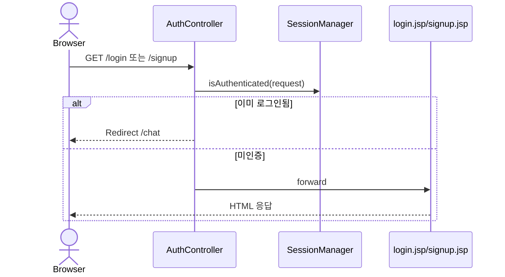
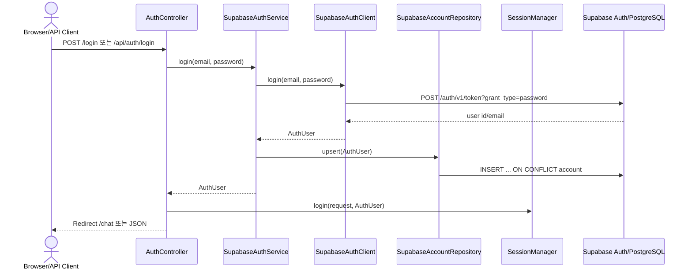
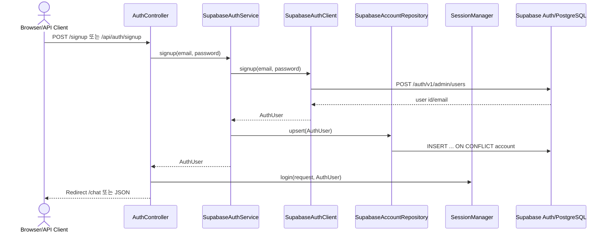
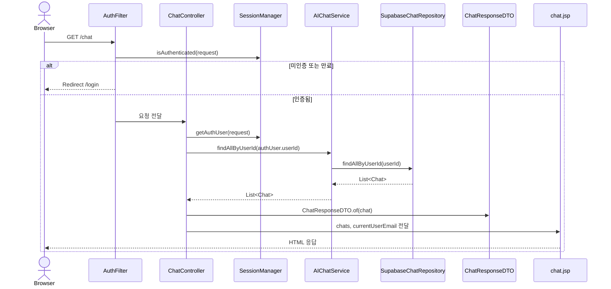
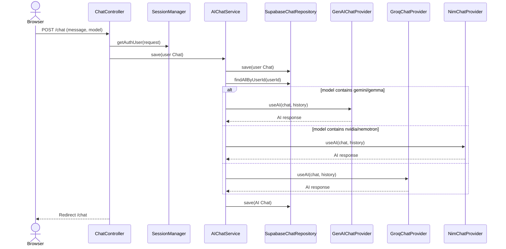

# ArChat 데이터 흐름 및 프로젝트 구조

## 1. 아키텍처 개요

ArChat은 Servlet/JSP 기반 MVC 구조 위에 layered/port-adapter 스타일을 적용한 프로젝트입니다. Controller는 HTTP 요청을 받고, Application Service는 유스케이스를 조합하며, Domain은 핵심 모델과 계약을 정의하고, Infrastructure는 DB/API/세션 같은 외부 기술 구현을 담당합니다.

| 계층 | 주요 파일 | 역할 |
|---|---|---|
| Presentation | `AuthController`, `ChatController`, `AuthFilter`, `EncodingFilter`, JSP | HTTP 요청 처리, 인증 보호, 화면 렌더링 |
| Application | `AIChatService`, `SupabaseAuthService`, `AuthService`, `AuthException` | 채팅/인증 유스케이스 조합 |
| Domain | `Chat`, `AuthUser`, `ChatService`, `ChatRepository`, `AccountRepository` | 핵심 모델과 인터페이스 |
| Infrastructure | `SupabaseChatRepository`, `SupabaseAccountRepository`, `SupabaseAuthClient`, AI Provider, `DatabaseUtil`, `SessionManager` | Supabase, AI API, JDBC, 세션 구현 |

## 2. 인증 흐름

### 2.1 로그인/회원가입 화면

### 2.2 로그인 처리

### 2.3 회원가입 처리

## 3. 채팅 흐름

### 3.1 채팅 화면 조회: `GET /chat`

### 3.2 메시지 전송: `POST /chat`

## 4. 현재 엔드포인트

| Method | Path | 설명 |
|---|---|---|
| GET | `/login` | 로그인 화면 |
| POST | `/login` | 폼 로그인 후 `/chat` 이동 |
| GET | `/signup` | 회원가입 화면 |
| POST | `/signup` | 폼 회원가입 후 `/chat` 이동 |
| POST | `/logout` | 세션 무효화 후 로그인 화면 이동 |
| GET | `/api/auth/me` | 현재 세션 사용자 확인 |
| POST | `/api/auth/login` | JSON 로그인 API |
| POST | `/api/auth/signup` | JSON 회원가입 API |
| POST | `/api/auth/logout` | JSON 로그아웃 API |
| GET | `/chat` | 채팅 화면 및 이력 조회 |
| POST | `/chat` | 사용자 메시지 저장 및 AI 응답 생성 |
