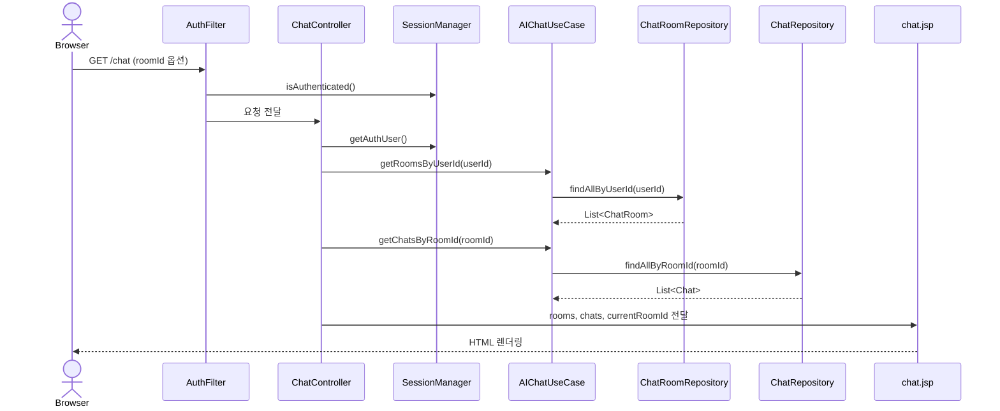
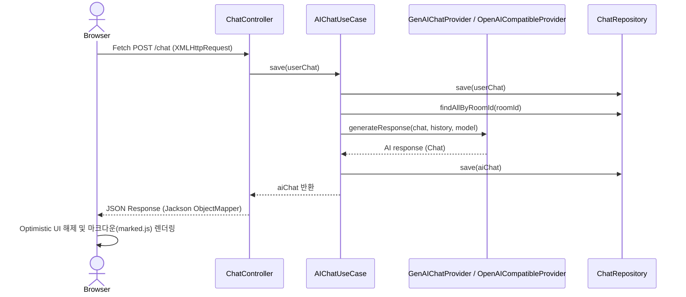

# ArChat 데이터 흐름 및 프로젝트 구조

## 1. 아키텍처 개요

ArChat은 Servlet/JSP 기반 MVC 구조 위에 layered/port-adapter 스타일을 적용한 프로젝트입니다. Controller는 HTTP 요청을 받고, Application Service(UseCase)는 비즈니스 로직을 조합하며, Domain은 핵심 모델과 계약을 정의하고, Infrastructure는 DB/API/세션 같은 외부 기술 구현을 담당합니다.

| 계층 | 주요 파일 | 역할 |
|---|---|---|
| Presentation | `AuthController`, `ChatController`, `AuthFilter`, JSP | HTTP 비동기(AJAX) 및 폼 요청 처리, 인증 보호, 화면 렌더링 |
| Application | `AIChatUseCase`, `DefaultAuthUseCase`, `AuthException` | 채팅방 관리/채팅 송수신 및 인증 유스케이스 조합 |
| Domain | `Chat`, `ChatRoom`, `AuthUser`, `ChatUseCase`, Repository 인터페이스 | 핵심 모델과 인터페이스 규약 |
| Infrastructure | `SupabaseChatRepository`, `SupabaseChatRoomRepository`, `SupabaseAuthClient`, AI Providers | Supabase, 외부 AI API(Gemini, Groq, NIM), JDBC 구현 |

## 2. 인증 흐름 (생략 - README 참고)
로그인 및 회원가입 흐름은 `AuthController` -> `DefaultAuthUseCase` -> `SupabaseAuthClient` 구조로 처리되며 세션을 통해 인증을 유지합니다.

## 3. 대화방 및 채팅 흐름

### 3.1 대화방 목록 및 채팅 화면 조회: `GET /chat`

### 3.2 메시지 비동기 전송: `POST /chat (action=sendMessage)`

## 4. 현재 엔드포인트

| Method | Path | 설명 |
|---|---|---|
| GET | `/login`, `/signup` | 인증 관련 뷰 제공 |
| POST | `/login`, `/signup` | 인증 폼 처리 및 리다이렉트 |
| POST | `/logout` | 세션 무효화 후 로그인 화면 이동 |
| GET | `/chat` | 전체 대화방 목록 로드 및 특정 대화방 이력 조회 |
| POST | `/chat` | `action` 파라미터에 따라 채팅 발송(AJAX), 방 생성, 이름 변경, 방 삭제 처리 |
