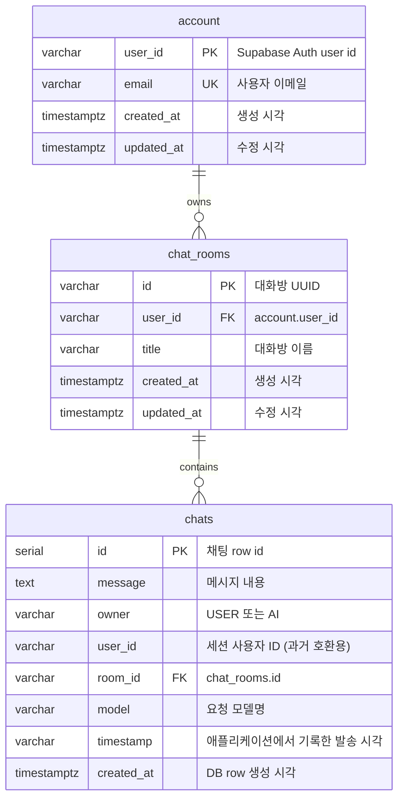

# Database Schema (Supabase)

ArChat은 Supabase PostgreSQL에 사용자 프로필성 계정 정보와 대화방, 채팅 이력을 저장합니다. 비밀번호는 프로젝트 DB에 저장하지 않고 Supabase Auth가 관리합니다.

## ERD

## `account` 테이블

Supabase Auth의 사용자 ID와 애플리케이션에서 표시할 이메일을 연결합니다.

| 컬럼 | 타입 | 제약 조건 | 설명 |
|---|---|---|---|
| `user_id` | `VARCHAR(255)` | `PRIMARY KEY` | Supabase Auth 사용자 ID |
| `email` | `VARCHAR(255)` | `NOT NULL`, `UNIQUE` | 사용자 이메일 |
| `created_at` | `TIMESTAMPTZ` | `NOT NULL DEFAULT NOW()` | 최초 생성 시각 |
| `updated_at` | `TIMESTAMPTZ` | `NOT NULL DEFAULT NOW()` | 마지막 갱신 시각 |

## `chat_rooms` 테이블

대화방 단위 관리를 위한 테이블입니다. 각 사용자는 여러 대화방을 소유할 수 있습니다.

| 컬럼 | 타입 | 제약 조건 | 설명 |
|---|---|---|---|
| `id` | `VARCHAR(255)` | `PRIMARY KEY` | 대화방의 고유 UUID 문자열 |
| `user_id` | `VARCHAR(255)` | `NOT NULL` | 소유한 사용자의 ID |
| `title` | `VARCHAR(255)` | `NOT NULL` | 대화방의 이름 (기본값: '새 대화방') |
| `created_at` | `TIMESTAMPTZ` | `DEFAULT NOW()` | 생성 시각 |
| `updated_at` | `TIMESTAMPTZ` | `DEFAULT NOW()` | 수정 시각 |

## `chats` 테이블

대화방 내의 사용자 메시지와 AI 응답을 모두 저장합니다.

| 컬럼 | 타입 | 제약 조건 | 설명 |
|---|---|---|---|
| `id` | `SERIAL` | `PRIMARY KEY` | 채팅 row 자동 증가 ID |
| `message` | `TEXT` |  | 메시지 본문 |
| `owner` | `VARCHAR(255)` |  | `USER` 또는 `AI` |
| `user_id` | `VARCHAR(255)` |  | 사용자 ID (과거 데이터 호환성 유지) |
| `room_id` | `VARCHAR(255)` | `NOT NULL` | 소속된 대화방 ID |
| `model` | `VARCHAR(255)` |  | 선택한 AI 모델명 |
| `timestamp` | `VARCHAR(100)` |  | 발송 시각 (`ZonedDateTime` 기반) |
| `created_at` | `TIMESTAMPTZ` | `DEFAULT NOW()` | DB 저장 시각 |
