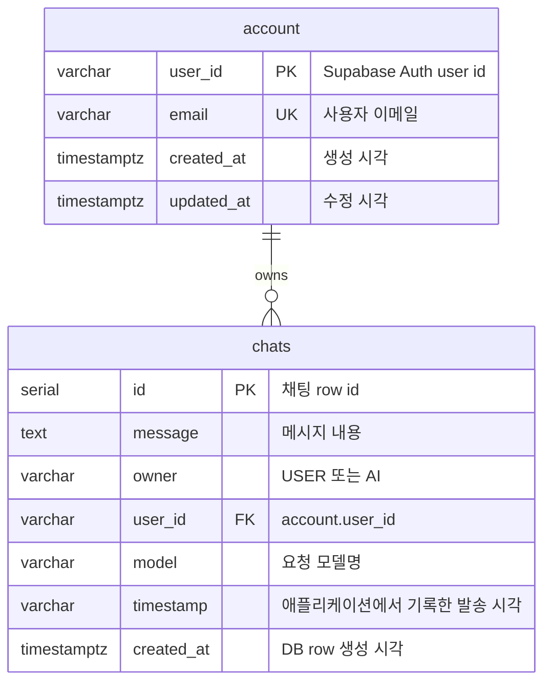

# Database Schema (Supabase)

ArChat은 Supabase PostgreSQL에 사용자 프로필성 계정 정보와 채팅 이력을 저장합니다. 비밀번호는 이 프로젝트 DB에 저장하지 않고 Supabase Auth가 관리합니다.

## ERD



## `account` 테이블

Supabase Auth의 사용자 ID와 애플리케이션에서 표시할 이메일을 연결합니다. `SupabaseAccountRepository.upsert()`가 로그인/회원가입 성공 시 이 테이블을 갱신합니다.

| 컬럼 | 타입 | 제약 조건 | 설명 |
|---|---|---|---|
| `user_id` | `VARCHAR(255)` | `PRIMARY KEY` | Supabase Auth 사용자 ID |
| `email` | `VARCHAR(255)` | `NOT NULL`, `UNIQUE` | 사용자 이메일 |
| `created_at` | `TIMESTAMPTZ` | `NOT NULL DEFAULT NOW()` | 최초 생성 시각 |
| `updated_at` | `TIMESTAMPTZ` | `NOT NULL DEFAULT NOW()` | 마지막 갱신 시각 |

```sql
CREATE TABLE account (
    user_id VARCHAR(255) PRIMARY KEY,
    email VARCHAR(255) NOT NULL UNIQUE,
    created_at TIMESTAMPTZ NOT NULL DEFAULT NOW(),
    updated_at TIMESTAMPTZ NOT NULL DEFAULT NOW()
);
```

## `chats` 테이블

사용자 메시지와 AI 응답을 모두 저장합니다. 현재 코드의 `SupabaseChatRepository`는 `id ASC` 기준으로 사용자별 채팅 이력을 조회합니다.

| 컬럼 | 타입 | 제약 조건 | 설명 |
|---|---|---|---|
| `id` | `SERIAL` | `PRIMARY KEY` | 채팅 row 자동 증가 ID |
| `message` | `TEXT` |  | 메시지 본문 |
| `owner` | `VARCHAR(255)` |  | `USER` 또는 `AI` |
| `user_id` | `VARCHAR(255)` |  | 세션 사용자 ID. 논리적으로 `account.user_id`와 연결 |
| `model` | `VARCHAR(255)` |  | 선택한 AI 모델명 |
| `timestamp` | `VARCHAR(100)` |  | `ZonedDateTime.now().toString()` 값 |
| `created_at` | `TIMESTAMPTZ` | `DEFAULT NOW()` | DB 저장 시각 |

```sql
CREATE TABLE chats (
    id SERIAL PRIMARY KEY,
    message TEXT,
    owner VARCHAR(255),
    user_id VARCHAR(255),
    model VARCHAR(255),
    timestamp VARCHAR(100),
    created_at TIMESTAMP WITH TIME ZONE DEFAULT NOW()
);
```

## 구현 기준 메모

- `account` 테이블 생성 SQL은 [account_table.sql](account_table.sql)에 별도로 보관되어 있습니다.
- 현재 `chats.user_id`에는 코드상 외래키 제약이 명시되어 있지 않습니다. 운영 DB에서 무결성을 강화하려면 `account(user_id)`를 참조하는 FK를 추가할 수 있습니다.
- `timestamp`는 문자열로 저장됩니다. 정렬은 `id ASC`로 수행하므로 현재 채팅 순서는 삽입 순서에 의존합니다.
